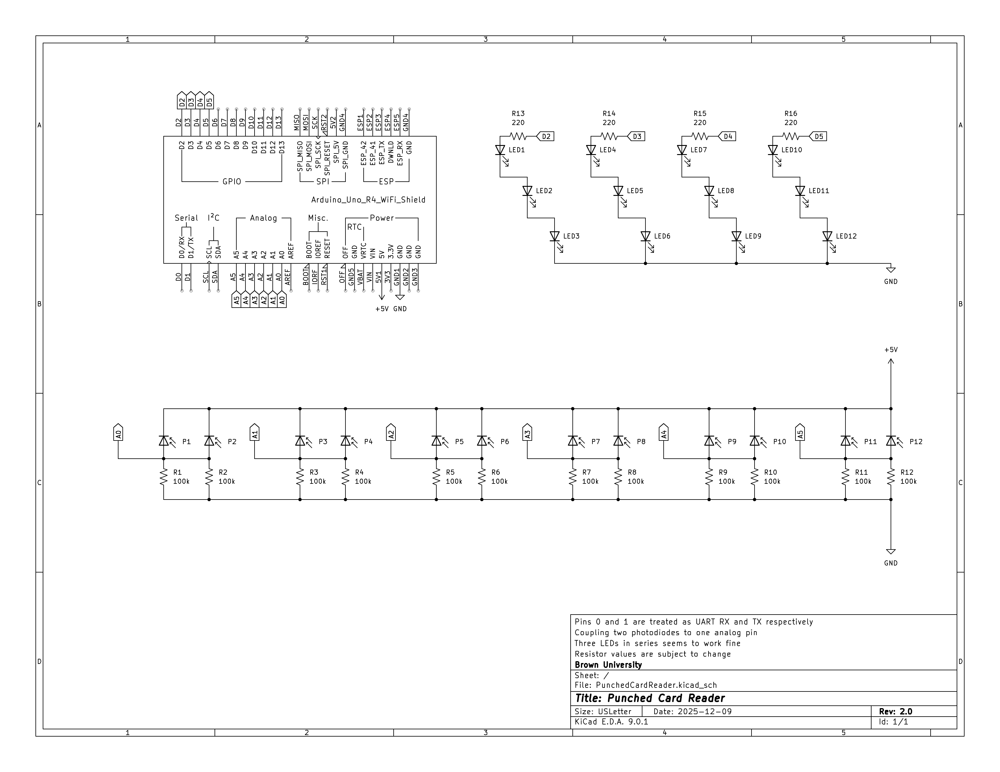

# punched-card-reader


## Overview
This project is an Arduino‑based punched card reader that optically senses holes in punched cards and streams the decoded information via serial communication. It is intended to illustrate operating-system and low‑level I/O concepts by recreating the characteristics of historical slow peripheral devices.

## Specifications
```
Punched Card Diameters
->  Length: 18.7325cm
->  Width: 8.255cm
->  Bits: 12 * 80 = 960b

Punched Card Reader:
->  Read start detected with an LED indicating the presence of a card
->  Notify card read start over serial
->  Starts with all LEDs off
->  Sampling Branch @ 1kHz:
  ->  Samples with LEDs off
  ->  Samples with LEDs on
  ->  Difference above a threshold comprises a sample of either 1 or 0
->  Reads 12 bits no more than 80 times and emits at most 16-bit words over serial
->  Read end detected with an LED indicating the absence of a card
->  Notify card read end over serial
```

## Project Directory Hierarchy
```
.
├── .github/                # GitHub Actions configuration files.
├── arduino/                # Arduino files for various sketches.
│   ├── PhotodiodeReadTest/ # Arduino sketch directory for testing photodiode readings.
│   └── punchedCardReader/  # Arduino sketch directory for the punched card reader.
├── cad/                    # CAD files for the punched card reader.
│   └── v1/                 # V1 prototype CAD files.
│   └── v2/                 # V2 prototype CAD files.
├── dafny/                  # Dafny verification files.
├── punchcard-generator/    # Punched card generator utility.
├── PunchedCardReader/      # Arduino sketch directory for the punched card reader.
├── serial-reader/         # Serial reader utility for reading data from the punched card reader.
└── sim/                    # Simulation files.
    └── test-cards/         # Sample punched card files for testing the simulation.
```

## CAD
We have created some preliminary CAD prototypes just to virtually explore the physical design of our system. These files, in `.obj`, `.stl`, and `.f3z` formats, can be found in the respective folders according to their versions.

## Hardware Requirements
- [Arduino® UNO R4 WiFi Board](https://store-usa.arduino.cc/products/uno-r4-wifi)

## Cloning the Repository
To clone the repository, use the following command:
```bash
git clone https://github.com/zzmic/punched-card-reader.git
```

## Arduino IDE Setup
The easiest way to set up the environment for compiling and uploading the Arduino sketches is to use the [Arduino IDE](https://www.arduino.cc/en/software/).
1. [Install](https://support.arduino.cc/hc/en-us/articles/360019833020-Download-and-install-Arduino-IDE) the Arduino IDE on a local machine.
2. Connect the Arduino® UNO R4 WiFi board to the local machine via a cable.
3. Open the Arduino IDE.
4. In the Arduino IDE, navigate to `Tools` > `Board` > `Board Manager...`, search for `Arduino UNO R4 WiFi`, and install the board core.
5. Nevigate to `File` > `Open...`, and open the `arduino/punchedCardReader/punchedCardReader.ino` file from the cloned repository.
6. In the Arduino IDE, navigate to `Tools` > `Port`, and select the port corresponding to the connected Arduino® UNO R4 WiFi board.
7. Set the baud rate of the serial monitor to `115200` by navigating to `Tools` > `Serial Monitor` and selecting `115200` from the dropdown menu at the top right of the serial monitor window.
8. Click the `Upload` button (right arrow icon) in the Arduino IDE to compile and upload the sketch to the Arduino board.

## Unit Testing
Unit tests for the punched card reader are located in `arduino/punchedCardReader/unitTests.h` and `arduino/punchedCardReader/unitTests.ino`.
To run these tests, first enable unit testing and testing modes by uncommenting the `#define UNIT_TESTING` macro in `arduino/punchedCardReader/punchedCardReader.ino`.
After doing so, compiling and uploading the sketch to the Arduino board will automatically execute the `runUnitTests()` function within the `setup()` phase.
The test results, showing pass/fail status for the photodiode driver, card processor, and stream processor modules, are displayed on the serial monitor, with a clean run ending with the messages `All photodiode driver unit tests passed :)`, `All card processor unit tests passed :)`, and `All Hollerith unit tests passed :)`.
The testing framework uses mock functions defined in `arduino/punchedCardReader/testUtils.ino`, such as `evenLEDsOn` and `sendPunchReading`, which are activated by the `#define TESTING` macro.
These mocks intercept hardware calls to set state flags (e.g., `evenLEDsOnCalled`), enabling the unit tests to verify that the correct hardware control logic runs without requiring physical interaction.

## Integration Testing
Integration tests for the punched card reader can be found at `arduino/punchedCardReader/softwareIntegrationTests.h` and `arduino/punchedCardReader/softwareIntegrationTests.ino`.
To run the integration tests, first enable integration testing and testing modes by uncommenting the `#define SOFTWARE_INTEGRATION_TESTING` macro in `arduino/punchedCardReader/punchedCardReader.ino`.
After doing so, compiling and uploading the sketch to the Arduino board drives the timer-based test harness that feeds a scripted sequence of sensor readings (simulating the card text `};`) into the system under test.
The harness invokes `checkMessages()` on each time step to compare the expected LED control, punch-reading generation, column/byte transmission, and card-end signaling against the actual mocked calls.
Results are printed to the serial monitor; any mismatch includes the expected and actual values, while a clean run ends with the message `finished software integration test (if only '};\n' was printed out, it passed)`.
The integration tests reuse the mock interfaces in `arduino/punchedCardReader/testUtils.ino`, such as `evenLEDsOn` and `sendPunchReading`, letting the tests validate the full sensing-to-streaming pipeline without actual hardware.

## Group Members
- Yi Lyo
- Patrick McCann
- Alexander Thaep
- Zhiwen "Michael" Zheng

## Appendix A: Makefile Usage for Arduino Sketches through Arduino CLI (Optional)
Alternatively, to compile and upload Arduino sketches to the Arduino® UNO R4 WiFi board, ensure that [Arduino CLI](https://arduino.github.io/arduino-cli/1.3/installation/) is installed and available in the system's PATH and that the [Arduino® UNO R4 WiFi board core](https://docs.arduino.cc/hardware/uno-r4-wifi/) is installed. More information about interacting with Arduino CLI can be found in its [official documentation](https://arduino.github.io/arduino-cli/1.3/).

The following make commands (`make help` for help) built on `arduino-cli` can be used.
- To list connected Arduino boards:
  ```bash
  make arduino-board-list
  ```
  Make sure to record the port of the connected Arduino® UNO R4 WiFi board (e.g., `/dev/ttyACM0` on Linux, `COM3` on Windows, or `/dev/cu.usbmodemXXXX` on macOS) for use with the `upload` commands.
- To update the local cache of available platforms and libraries:
  ```bash
  make arduino-core-update-index
  ```
- To install the core for the Arduino® UNO R4 WiFi board:
  ```bash
  make arduino-core-install
  ```
- To list installed/available cores:
  ```bash
  make arduino-core-list
  ```
- To compile the Arduino sketch specified in FILE:
  ```bash
  make arduino-compile FILE=<path-to-sketch>
  ```
- To compile and upload the compiled Arduino sketch specified in FILE to the Arduino board at PORT:
  ```bash
  make arduino-compile-and-upload FILE=<path-to-sketch> PORT=<serial-port>
  ```

## Appendix B: Build and Run the Punched Card Reader Simulation (Optional)
Before building the simulation, ensure that a compatible [GCC](https://gcc.gnu.org) compiler that [supports C++14 or later](https://gcc.gnu.org/projects/cxx-status.html#cxx14) is [installed](https://gcc.gnu.org/install/) and available in the system's PATH.

The simulation of the *early design* of the punched card reader is implemented in C++ and can be built and run using the provided `Makefile` (`make help` for help).
1. Run `make sim-build` to build the simulation.
2. Run `./sim/bin/main` to start the simulation in interactive mode (specify the `--binary-mode` flag for binary output mode).
3. "Insert" a card file containing a 80 (column) * 12 (row) grid, where each entry represents a punch (any character other than `.` and whitespace) or no punch (`.` or whitespace). Sample card files are available in the `sim/test-cards/` directory.
4. To exit the simulation, type `done` when prompted for the next card file path. Otherwise, more card files can be input to continue the simulation.
5. Alternatively, do `make sim-test` (or `make sim-test-binary`) to run the simulation on *ALL* the test cards in the `sim/test-cards/` directory.

## Appendix C: Verification with Dafny (Optional)
The Dafny files in the `dafny/v1/` directory *aim* to formally verify, at the algorithmic level, the correctness of the logic of core components based on the *early design* of the punched card reader using [the Dafny programming and verification language](https://dafny.org).
The Dafny implementation does not directly interact with the Arduino hardware or the Arduino framework; instead, it focuses solely on verifying the algorithms and data structures used in the punched card reader's software design.
Due to time constraints, the Dafny programs might not comprehensively cover the up-to-date punched card reader's functionality (i.e., we do *not* claim full verification of the entire system), but they still serve as a useful tool for spotting potential issues we might encounter during system design, specification, and implementation.

To verify the Dafny programs, ensure that [the Dafny binary build or the VSCode extension for Dafny (Dafny VSCode)](https://dafny.org/latest/Installation) is installed.
If using the command line, run the following command from the project's root directory:
```bash
dafny verify dafny/v1/*.dfy
```
