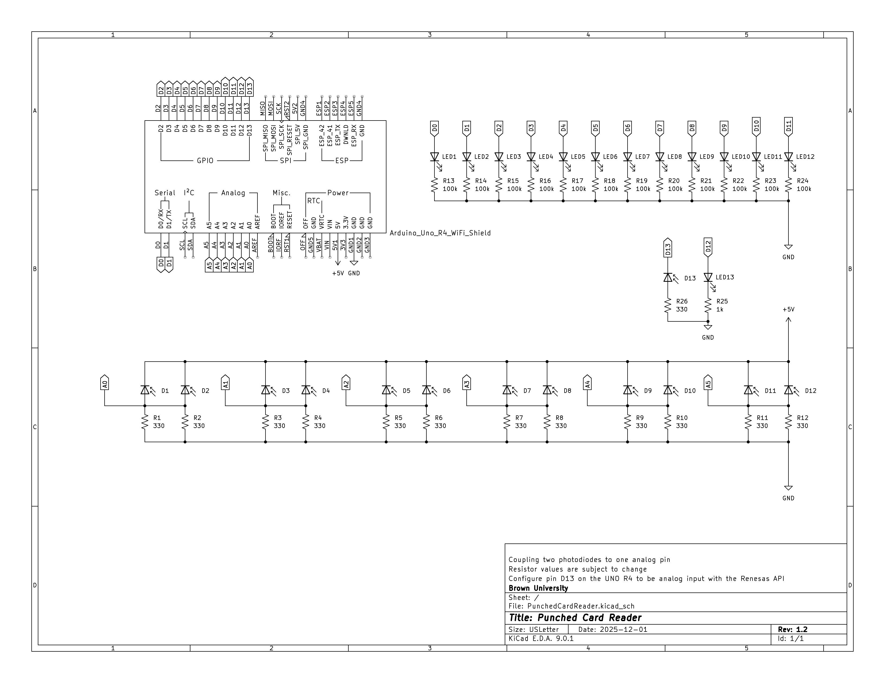

# punched-card-reader


## Overview
This project is an Arduino‑based punched card reader that optically senses holes in punched cards and streams the decoded information via serial communication. It is intended to illustrate operating-system and low‑level I/O concepts by recreating the characteristics of historical slow peripheral devices.

## Specifications
```
Punched Card Diameters
->  Length: 18.7325cm
->  Width: 8.255cm
->  Bits: 12 * 80 = 960b

Punched Card Reader:
->  Read start detected with an LED indicating the presence of a card
->  Notify card read start over serial
->  Starts with all LEDs off
->  Sampling Branch @ 1kHz:
  ->  Samples with LEDs off
  ->  Samples with LEDs on
  ->  Difference above a threshold comprises a sample of either 1 or 0
->  Reads 12 bits no more than 80 times and emits at most 16-bit words over serial
->  Read end detected with an LED indicating the absence of a card
->  Notify card read end over serial
```

## Project Hierarchy
```
punched-card-reader/
|-- .github/                   # GitHub Actions configuration files.
|-- arduino/                   # Arduino-related files.
    |-- PhotodiodeReadTest/    # Arduino sketch directory for testing photodiode readings.
|-- cad/                       # CAD files for the punched card reader.
    |-- v1/                    # V1 prototype CAD files.
|-- dafny/                     # Dafny verification files.
|-- modules/                   # Arduino sketch modules.
    |-- cardProcessor/         # Main punched card processor Arduino sketch, including source and test files.
|-- sim/                       # Simulation files.
    |-- test-cards/            # Sample punched card files for testing the simulation.
|-- README.md                  # Project documentation.
```

## CAD
We have created some preliminary CAD prototypes just to virtually explore the physical design of our system. These files, in `.obj`, `.stl`, and `.f3z` formats, can be found in the respective folders according to their versions.

## Hardware Requirements
- [Arduino® UNO R4 WiFi Board](https://store-usa.arduino.cc/products/uno-r4-wifi)

## Software Requirements
- [Arduino CLI](https://arduino.github.io/arduino-cli/1.3/installation/): A command-line interface for Arduino development.
- [Arm GNU Toolchain](https://developer.arm.com/Tools%20and%20Software/GNU%20Toolchain): A collection of tools for compiling and debugging ARM-based applications.
- A GCC compiler that supports C++11 or later for building the simulation.

## Build and Run the Punched Card Reader Simulation
The simulation of the punched card reader is implemented in C++ and can be built and run using the provided `Makefile` (`make help` for help):
1. Run `make sim-build` to build the simulation.
2. Run `./sim/bin/main` to start the simulation in interactive mode (specify the `--binary-mode` flag for binary output mode).
3. "Insert" a card file containing a 12 (row) * 80 (column) grid, where each entry represents a punch (any character other than `.` and whitespace) or no punch (`.` or whitespace). Sample card files are available in the `sim/test-cards/` directory.
4. To exit the simulation, type `done` when prompted for the next card file path. Otherwise, more card files can be input to continue the simulation.
5. Alternatively, do `make sim-test` (or `make sim-test-binary`) to run the simulation on *ALL* the test cards in the `sim/test-cards/` directory.

## Compile and Upload Arduino Sketches to the Arduino Board with the Makefile
If `arduino-cli` is installed and the Arduino® UNO R4 WiFi board is connected to the local machine, the following make commands (`make help` for help) that are built upon `arduino-cli` can be used.
- To list connected Arduino boards:
  ```bash
  make arduino-board-list
  ```
  Make sure to record the port of the connected Arduino® UNO R4 WiFi board (e.g., `/dev/ttyACM0` on Linux, `COM3` on Windows, or `/dev/cu.usbmodemXXXX` on macOS) for use with the `upload` commands.
- To update the local cache of available platforms and libraries:
  ```bash
  make arduino-core-update-index
  ```
- To install the core for the Arduino® UNO R4 WiFi board:
  ```bash
  make arduino-core-install
  ```
- To list installed/available cores:
  ```bash
  make arduino-core-list
  ```
- To compile the Arduino sketch specified in FILE:
  ```bash
  make arduino-compile FILE=<path-to-sketch>
  ```
- To upload the compiled Arduino sketch specified in FILE to the Arduino board at PORT:
  ```bash
  make arduino-upload FILE=<path-to-sketch> PORT=<serial-port>
  ```

## Unit Testing
Unit tests for the punched card reader can be found in the `PunchedCardReader/test/` directory.

- ***TODO(zzmic):*** Decide which testing framework to use and provide instructions on how to run the tests. Alternatively, we may not use a testing framework at all and instead implement unit tests in `.ino` files that can be compiled and uploaded to the Arduino board.

## Verification with Dafny
The punched card reader's core logic is formally verified at the algorithmic level using [Dafny](https://dafny.org). The Dafny files are located in the `dafny/` directory.
To verify the Dafny files, ensure that [the Dafny binary build or the VSCode extension for Dafny (Dafny VSCode)](https://dafny.org/latest/Installation) is installed.
If using the command line, run the following command from the project's root directory:
```bash
dafny verify dafny/*
```

## Caveats
- Note that the `setup()` and `loop()` functions can only appear once per sketch. If additional sketches are included, ensure that they do not redefine these functions to avoid compilation errors.

## Group Members
- Yi Lyo
- Patrick McCann
- Alexander Thaep
- Zhiwen "Michael" Zheng

## References
- [Arduino CLI Documentation](https://arduino.github.io/arduino-cli/1.3/)
- [Arduino Example: Blink](https://docs.arduino.cc/built-in-examples/basics/Blink/)
- [Arduino Example: Calibrate Sensor Input](https://docs.arduino.cc/built-in-examples/analog/Calibration/)
- [Arm GNU Toolchain](https://developer.arm.com/Tools%20and%20Software/GNU%20Toolchain)
- [Arm GNU Toolchain Downloads](https://developer.arm.com/downloads/-/arm-gnu-toolchain-downloads)
- [gcc-arm-embedded — Homebrew Formulae](https://formulae.brew.sh/cask/gcc-arm-embedded)
- [Test Driving Arduino](https://christopherjmcclellan.wordpress.com/2018/02/16/test-driving-arduino/)
- [CppUTest](https://cpputest.github.io)
- [Unity](https://github.com/ThrowTheSwitch/Unity)
